# CT和MR图像融合
    方法介绍：
        通过规膝关节CT和MR图像进行分割，然后拿分割得到的MR上的股骨和CT
    上的股骨，进行配准，得到粗配准矩阵，然后将MR上的软骨变换到CT上，然后
    再将变换后的软骨与CT上的股骨进行精配，得到精配准矩阵。得到精配准矩阵
    后，可以将MR图和CT图像进行对齐，从而实现MR图像和CT图像的融合。

## CT分割
    CT分割采用的GraphCut算法，具体算法见下面的地址
    https://github.com/BigPandaCPU/KneeJointSegByGraphCut  
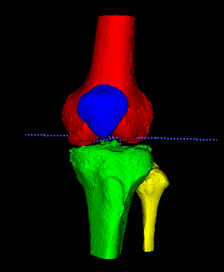
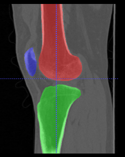

## MR分割
    MR分割是基于nnUnet框架，在膝关节MR开源数据集OAI上训练得到的膝关节MR分割模型。  
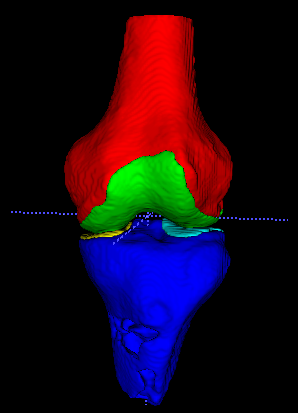
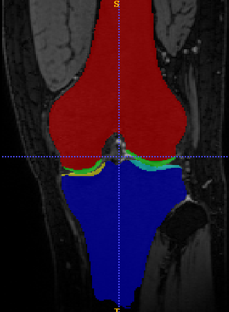

## 配准
    分别拿CT的股骨和MR的股骨进行配准，配准完成后，将MR上的软骨变换到CT上。

## 数据说明
    data文件夹下，有CT和MR两个子文件夹，其中CT文件夹下面是img.nii.gz和mask.nii.gz，
    是图像和mask，MR文件夹下也是相同的。

## 使用步骤 
    下面以股骨配准为例，进行说明
### 1.获取CT的股骨和MR的股骨、股骨软骨stl文件
    运行convert_nii2stl.py文件，分别提取CT和MR上的股骨、股骨软骨的stl文件。运行完成后，需要对文件进行重命名。

### 2.获取MR上的软骨边界
    运行get_boundary_mask.py文件，获取股骨软骨的边界mask文件。并再次调用convert_nii2stl.py文件，生成对应的软骨边界stl文件。  

### 3.进行配准和对齐
    运行femur_cartilage_registration.py文件，对股骨进行配准，并将MR上的股骨软骨配准到CT上。根据配准矩阵，实现MR和CT的对齐。

## 融合结果展示
### CT股骨软骨融合效果
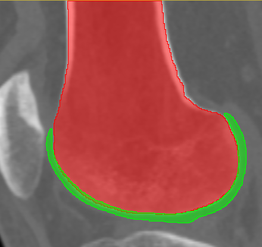
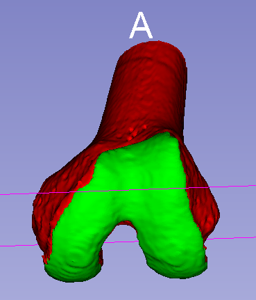

### CT胫骨软骨融合效果
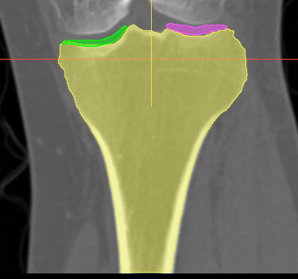
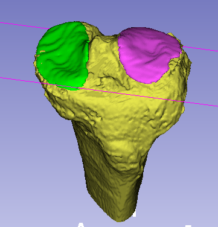

### 股骨，CT和MR融合效果，
    融合采用的是MITK软件进行融合的。具体操作见MITK使用说明。
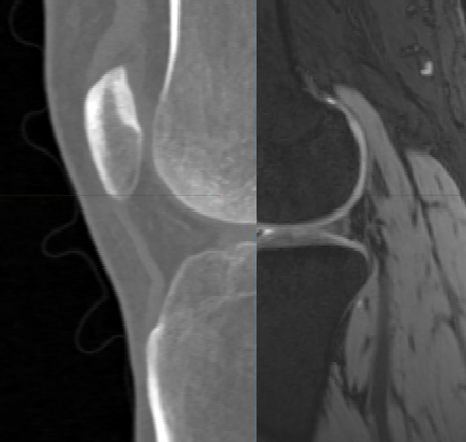
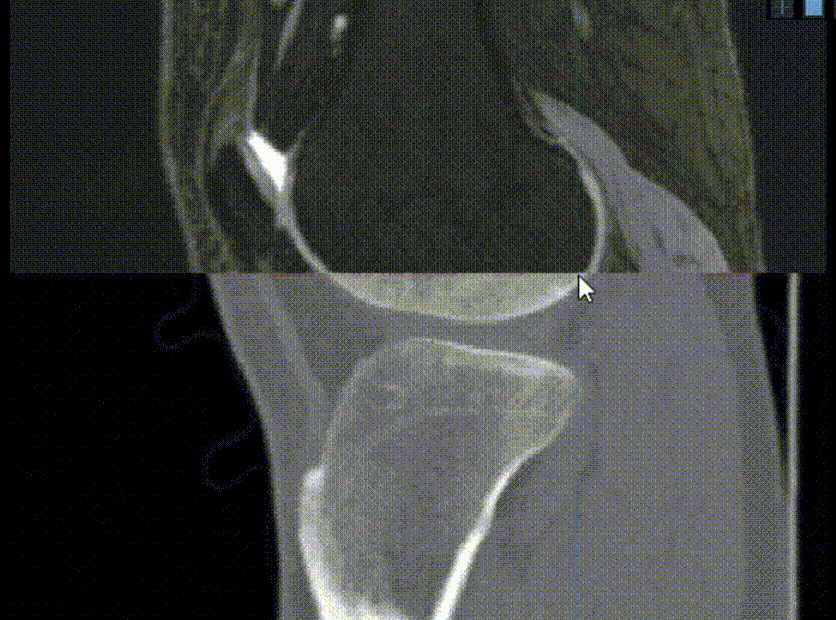

### 胫骨， CT和MR融合效果
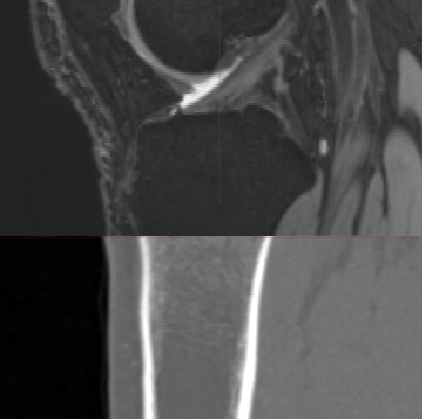
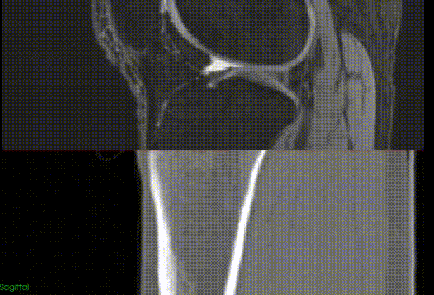

## 注意事项
1. CT的方向和MR的方向，默认都是相同的。
    实际拍摄的时候CT一般是RAI(ITK-snap下， DICOM下是LPS)，而MR一般是ASL(ITK-snap下， DICOM下是PIR)
    在调用covnert_nii2stl.py脚本的时候，需要将mask三维表面重建成stl，由于vtk.vtkImageImport()这个对
    direction的支持不友好，没法设置方向。所以最简单的处理方法是，默认CT和MR图像的格式都是相同的。可以在融合
    前，将MR的direction设置成宇CT的direction相同，其他的参数不用变。

## 存在的问题
1. 胫骨软骨进行ICP精细配准的时候，会出现胫骨近端和远端的配准精度不一样
近端配准结果如下：  
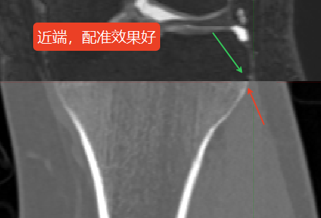  
远端配准结果如下：  
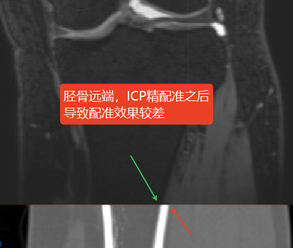  
    